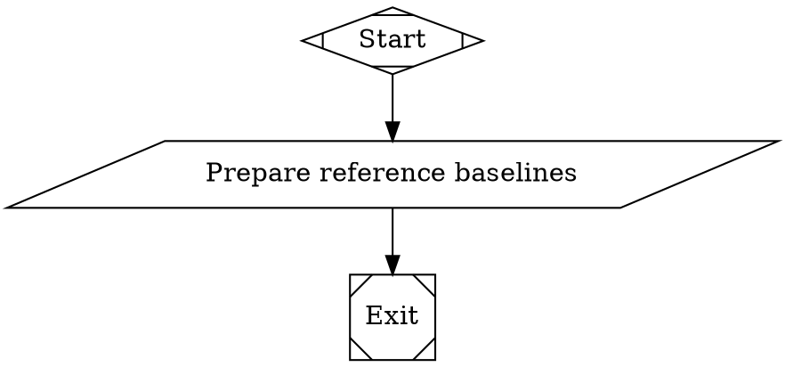
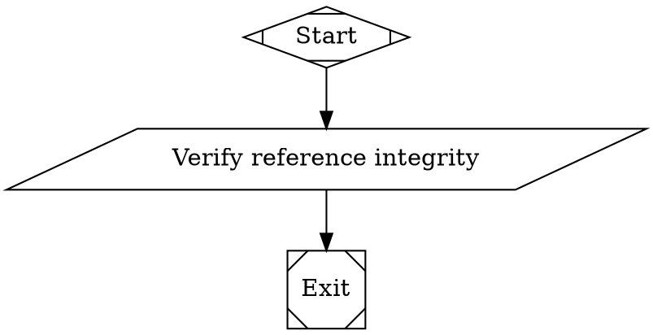

# Expert Builder Reference Repositories Implementation Plan

> **Execution:** Use the subagent-driven-development workflow to implement this plan.

**Goal:** Add optional trusted reference-repository awareness to `expert_builder` while preserving one authorized write/delivery target and proving references remain unchanged.

**Architecture:** Two closed-package deterministic DOT helpers prepare and verify reference baselines. The parent graph invokes the verifier after every tool-capable stage, passes validation references explicitly into RealityCheck, and terminates without target repair when dependency documentation or installation is unavailable. Existing no-reference behavior and target-repair loops remain intact.

**Tech Stack:** Attractor DOT graphs, embedded Python 3 standard-library scripts, Git plumbing, pytest, `amplifier_module_loop_pipeline`, `amplifier-digital-twin`, Resolve remote DOT materialization.

---

## Execution rules

- Work from `/home/robotdad/Work/sunshine/pipelines`.
- This is direct pipeline authoring. Do **not** submit this design or plan to `expert_builder` as build input.
- Re-read `/home/robotdad/Work/sunshine/AGENTS.md`, `README.md`, and any newly added repo-local convention files before implementation, verification, and the later finish/push phase.
- Every DOT creation or edit must be delegated to `dot-graph:dot-author`. Do not directly edit DOT files.
- After each DOT batch, delegate a quality pass to `dot-graph:diagram-reviewer`. Before claiming runtime semantics are correct, consult `attractor-expert` with the resulting graph and test evidence.
- Non-DOT tests and documentation may be changed by a normal implementation agent.
- Keep all fixtures, clones, logs, and run directories below `/home/robotdad/Work/sunshine/.work/`; never use `/tmp`.
- Do not add dependencies or modify `pyproject.toml`, `uv.lock`, `.github/workflows/package-test.yml`, or `expert_builder/admit/` unless failing evidence proves the locked design impossible. Stop and surface that evidence before widening scope.
- Do not create commits during Tasks 1–14. Commit, push, remote hydration, and Resolve acceptance are separate post-implementation gates.

## Locked interfaces

### Public pipeline input

`references` is an optional scalar containing JSON text. Omitted, pipeline-context null, `""`, whitespace-only, and `[]` normalize to an empty list. Non-whitespace JSON must be an array. Each element is exactly:

```json
{
  "id": "stable-unique-name",
  "path": "/existing/non-bare/git/worktree/or/a/path-inside-it",
  "use_in_validation": false
}
```

`id` and `path` are required non-empty strings. `use_in_validation` is an optional boolean defaulting to `false`. Unknown keys fail closed.

### Prepared artifact

`expert_builder/references/prepare.dot` writes `.ai/references.json` with this shape:

```json
{
  "schema_version": 1,
  "target_root": "/canonical/target/worktree",
  "references": [
    {
      "id": "example",
      "path": "/canonical/reference/worktree",
      "use_in_validation": false,
      "baseline": {
        "head": "<40-char SHA or UNBORN>",
        "ref": "refs/heads/main or DETACHED",
        "digest": "<sha256>",
        "dimensions": {
          "index": "<sha256>",
          "tracked_worktree": "<sha256>",
          "untracked": "<sha256>",
          "submodules": "<sha256>"
        }
      }
    }
  ]
}
```

It also writes `.ai/reference_context.md`. That file must name the canonical target, list references in caller order, identify context-only versus validation dependencies, and say explicitly that only the target may be modified, staged, committed, or delivered.

The preparation node publishes `reference_state="prepared"`. The verification node publishes `reference_integrity_state="unchanged"`; on a mismatch it exits non-zero and reports the reference ID plus changed dimensions to stderr. Neither artifact stores reference file contents.

### Fingerprint algorithm

Use the same private snapshot routine in both helper DOT scripts. Do not substitute a weaker `git status`-only check.

1. Resolve the canonical worktree root with `git -C <path> rev-parse --show-toplevel`, then `Path.resolve(strict=True)`.
2. Reject a bare repository using `git rev-parse --is-bare-repository`.
3. Record HEAD using `git rev-parse --verify HEAD`; use `UNBORN` only when that command fails because no commit exists.
4. Record the symbolic ref with `git symbolic-ref -q HEAD`; use `DETACHED` when absent.
5. Hash these byte streams independently:
   - `index`: `git ls-files --stage -z`.
   - `tracked_worktree`: `git status --porcelain=v2 -z --untracked-files=no --ignore-submodules=none` plus `git diff --binary --full-index --no-ext-diff`.
   - `untracked`: sorted `git ls-files --others --exclude-standard -z`; for each path hash the path, Git-visible type/mode, and either file bytes or symlink target without following the symlink.
   - `submodules`: `git submodule status --recursive` (an empty byte stream is valid).
6. Hash a canonical JSON object containing HEAD, ref, and the four dimension digests to produce `digest`.

Ignored files are deliberately absent. File mode, symlink, index/staged, tracked working-tree, untracked content/path, ref/HEAD, and Git-reported submodule changes must alter at least one digest.

### RealityCheck dependency plan

Before `DetectDUT`, RealityCheck writes `.rc/reference_dependencies.json`:

```json
{
  "schema_version": 1,
  "status": "ready",
  "dependencies": [
    {
      "id": "plugin-compat",
      "documentation": {
        "status": "resolved",
        "path": "/canonical/reference/README.md",
        "section": "Standalone CLI",
        "candidates": []
      },
      "public_dependency": {
        "identity": "git+https://github.com/robotdad/amplifier-bundle-plugin-compat",
        "version": null
      },
      "setup_steps": ["uv tool install git+https://github.com/robotdad/amplifier-bundle-plugin-compat"],
      "use_steps": ["amplifier-plugins validate demo-plugin"],
      "setup_results": [],
      "use_results": []
    }
  ],
  "failure": null
}
```

Only entries with `use_in_validation=true` appear, in caller array order. Missing/ambiguous documentation produces `status="reference_prerequisite_failed"` and a populated `failure` object containing `reference_id`, `cause`, citation status, and inspected candidates. This is internal derived planning, not caller input.

## Phase 1 — Deterministic reference guards

### Task 1: Create the test harness and prove the helpers are absent

**Files:**
- Create: `tests/test_reference_repository_guard.py`

- [ ] **Step 1: Add exact test utilities.** Start the file with:

```python
"""Behavioral tests for expert_builder reference preparation and integrity guards."""

from __future__ import annotations

import asyncio
import json
import os
import stat
import subprocess
from pathlib import Path

from amplifier_module_loop_pipeline.context import PipelineContext
from amplifier_module_loop_pipeline.dot_parser import parse_dot
from amplifier_module_loop_pipeline.handlers.tool import ToolHandler
from amplifier_module_loop_pipeline.outcome import Outcome, StageStatus
from amplifier_module_loop_pipeline.validation import validate_or_raise

ROOT = Path(__file__).parents[1]
PREPARE_DOT = ROOT / "expert_builder" / "references" / "prepare.dot"
VERIFY_DOT = ROOT / "expert_builder" / "references" / "verify.dot"
UNSET = object()


def git(cwd: Path, *args: str, check: bool = True) -> subprocess.CompletedProcess[str]:
    return subprocess.run(
        ["git", *args], cwd=cwd, check=check, capture_output=True, text=True
    )


def init_repo(path: Path, *, filename: str = "tracked.txt", content: str = "base\n") -> Path:
    path.mkdir(parents=True)
    git(path, "init", "-q")
    git(path, "config", "user.email", "tests@example.invalid")
    git(path, "config", "user.name", "Pipeline Tests")
    (path / filename).write_text(content, encoding="utf-8")
    git(path, "add", filename)
    git(path, "commit", "-q", "-m", "initial")
    return path


def load_graph(path: Path):
    graph = parse_dot(path.read_text(encoding="utf-8"))
    graph.source_dir = str(path.parent)
    validate_or_raise(graph)
    return graph


def run_tool_node(
    dot_path: Path,
    node_id: str,
    target: Path,
    **context_values: object,
) -> tuple[Outcome, PipelineContext]:
    graph = load_graph(dot_path)
    context = PipelineContext()
    context.set("context.target_dir", str(target))
    for key, value in context_values.items():
        context.set(key, value)
    outcome = asyncio.run(
        ToolHandler().execute(
            graph.nodes[node_id], context, graph, str(target / ".test-logs")
        )
    )
    return outcome, context


def prepare(target: Path, references: object = UNSET) -> tuple[Outcome, PipelineContext]:
    values = {} if references is UNSET else {"references": references}
    return run_tool_node(PREPARE_DOT, "PrepareReferences", target, **values)


def verify(target: Path) -> tuple[Outcome, PipelineContext]:
    return run_tool_node(VERIFY_DOT, "VerifyReferences", target)
```

- [ ] **Step 2: Add the first RED test.** Add:

```python
def test_reference_helper_dots_exist() -> None:
    assert PREPARE_DOT.is_file()
    assert VERIFY_DOT.is_file()
```

- [ ] **Step 3: Run the test and observe the intended failure.**

Run:

```bash
cd /home/robotdad/Work/sunshine/pipelines
uv run pytest -q tests/test_reference_repository_guard.py::test_reference_helper_dots_exist
```

Expected: `FAILED` because `expert_builder/references/prepare.dot` and `verify.dot` do not exist. Do not create placeholder files to make this pass.

### Task 2: Specify input normalization, schema, and canonical path behavior

**Files:**
- Modify: `tests/test_reference_repository_guard.py`

- [ ] **Step 1: Add normalization tests.** Parameterize `None`, `""`, whitespace, and `"[]"`; initialize a target repo; run `prepare`; assert success, `reference_state == "prepared"`, an empty `references` array, and both `.ai` artifacts exist.

```python
import pytest

@pytest.mark.parametrize("raw", [UNSET, None, "", "  \n\t", "[]"])
def test_empty_inputs_normalize_to_empty_reference_list(tmp_path: Path, raw: object) -> None:
    target = init_repo(tmp_path / "target")
    outcome, context = prepare(target, raw)
    assert outcome.status == StageStatus.SUCCESS
    assert context.get("reference_state") == "prepared"
    data = json.loads((target / ".ai/references.json").read_text(encoding="utf-8"))
    assert data["schema_version"] == 1
    assert data["target_root"] == str(target.resolve())
    assert data["references"] == []
    assert "only authorized write and delivery target" in (
        target / ".ai/reference_context.md"
    ).read_text(encoding="utf-8").lower()
```

- [ ] **Step 2: Add invalid-shape tests.** Parameterize JSON text `null`, `{}`, `"x"`, `1`, `true`, entries with empty strings, wrong types, unknown keys, and duplicate IDs. Assert `StageStatus.FAIL` and that the failure reason includes the offending field or invariant.

- [ ] **Step 3: Add path tests.** Cover missing path, non-Git directory, bare Git repository, a path inside a valid worktree normalizing to the canonical root, target/reference equality, target containing reference, reference containing target, and overlap between two references. Use nested Git repositories where containment is required; assert every overlap fails before writing a successful manifest.

- [ ] **Step 4: Add valid single/multiple reference tests.** Assert caller order is preserved, omitted `use_in_validation` becomes `false`, canonical paths are stored, and the context markdown labels validation dependencies distinctly.

- [ ] **Step 5: Run all preparation contract tests RED.**

Run:

```bash
uv run pytest -q tests/test_reference_repository_guard.py -k 'empty_inputs or invalid or path or overlap or valid'
```

Expected: failures caused by missing `prepare.dot`; after Task 4, this exact subset must pass.

### Task 3: Specify baseline and mutation detection behavior

**Files:**
- Modify: `tests/test_reference_repository_guard.py`

- [ ] **Step 1: Add baseline privacy and dirty-start tests.** Create one modified tracked file and one untracked file before preparation. Assert preparation succeeds, the manifest contains only metadata/digests (neither file content appears in serialized JSON), and immediate verification succeeds.

- [ ] **Step 2: Add ignored-file behavior.** Commit `.gitignore`, prepare, change an ignored file, and assert verification remains `SUCCESS` with `reference_integrity_state == "unchanged"`.

- [ ] **Step 3: Add mutation tests.** Parameterize mutations performed after preparation:
  - modify a tracked file;
  - stage a tracked change;
  - create/change an untracked file;
  - chmod a tracked executable bit;
  - replace a tracked symlink target;
  - create a new branch and commit, changing HEAD/ref.

For each, assert verification is `FAIL`, the failure reason names the reference ID, and at least one of `index`, `tracked_worktree`, `untracked`, `submodules`, `head`, or `ref` appears.

- [ ] **Step 4: Add a local submodule test.** Set `git -c protocol.file.allow=always submodule add <local-repo> deps/child`, commit, prepare, advance the child checkout, and assert verification fails with `submodules` in the diagnostic. Keep both repos below `tmp_path`.

- [ ] **Step 5: Run the integrity tests RED.**

Run:

```bash
uv run pytest -q tests/test_reference_repository_guard.py -k 'baseline or dirty or ignored or mutation or submodule'
```

Expected: failures caused by missing helper DOTs. No mutation case may pass accidentally.

### Task 4: Author `references/prepare.dot`

**Files:**
- Create: `expert_builder/references/prepare.dot`
- Test: `tests/test_reference_repository_guard.py`

- [ ] **Step 1: Delegate DOT creation to `dot-graph:dot-author`.** Give it the locked input contract, prepared artifact schema, fingerprint algorithm, and the required graph below. The only tool node is `PrepareReferences`; it uses `tool_env="references"`, `parse_json="true"`, Python standard library only, diagnostics on stderr, and pure JSON stdout.



The script must:

1. normalize the empty cases before `json.loads`;
2. validate exact keys/types;
3. canonicalize target/reference worktree roots;
4. reject all equality/containment overlaps using `os.path.commonpath` on canonical roots;
5. calculate the locked digest dimensions;
6. atomically write `.ai/references.json` and `.ai/reference_context.md` using same-directory temporary files plus `os.replace`;
7. print only `{"reference_state":"prepared"}` to stdout.

- [ ] **Step 2: Validate immediately.** Use `dot_graph(operation="validate")` on the complete new DOT and require syntax, structural, and render layers to pass.

- [ ] **Step 3: Run the preparation tests GREEN while leaving the verifier RED.**

Run:

```bash
uv run pytest -q tests/test_reference_repository_guard.py -k 'empty_inputs or invalid or path or overlap or valid'
```

Expected: every selected preparation test passes. The separate `test_reference_helper_dots_exist` remains RED until `verify.dot` is authored in Task 5.

### Task 5: Author `references/verify.dot`

**Files:**
- Create: `expert_builder/references/verify.dot`
- Test: `tests/test_reference_repository_guard.py`

- [ ] **Step 1: Delegate DOT creation to `dot-graph:dot-author`.** Require this graph:



The embedded script must load `.ai/references.json`, reject a missing/invalid schema, recompute the **same** fingerprint algorithm, compare HEAD/ref and all four dimensions, and fail non-zero with a bounded stderr diagnostic listing reference ID and changed dimension names. On success stdout is exactly `{"reference_integrity_state":"unchanged"}`. It must never reset or modify a reference.

- [ ] **Step 2: Validate immediately.** Run `dot_graph` validation on both helper graphs.

- [ ] **Step 3: Run the full helper test module GREEN.**

Run:

```bash
uv run pytest -q tests/test_reference_repository_guard.py
```

Expected: all tests pass.

- [ ] **Step 4: Delegate a quality review.** Send both helper DOTs and the passing test output to `dot-graph:diagram-reviewer`; resolve every blocking finding through `dot-graph:dot-author`, then rerun the helper tests.

## Phase 2 — Parent wiring and stage boundaries

### Task 6: Write structural wiring tests before editing the parent

**Files:**
- Create: `tests/test_expert_builder_reference_wiring.py`
- Test: `expert_builder/expert_builder.dot`

- [ ] **Step 1: Add graph helpers.** Use `parse_dot`, `validate_or_raise`, and helpers that assert an edge by `(from_node, to_node, condition)`.

```python
"""Structural and behavioral contracts for expert_builder reference wiring."""

from __future__ import annotations

import asyncio
import json
import subprocess
from pathlib import Path

from amplifier_module_loop_pipeline.context import PipelineContext
from amplifier_module_loop_pipeline.dot_parser import parse_dot
from amplifier_module_loop_pipeline.handlers.tool import ToolHandler
from amplifier_module_loop_pipeline.outcome import StageStatus
from amplifier_module_loop_pipeline.validation import validate_or_raise

ROOT = Path(__file__).parents[1]
PACKAGE = ROOT / "expert_builder"


def graph(name: str):
    path = PACKAGE / name
    parsed = parse_dot(path.read_text(encoding="utf-8"))
    parsed.source_dir = str(path.parent)
    validate_or_raise(parsed)
    return parsed


def assert_edge(parsed, source: str, target: str, condition: str = "") -> None:
    assert any(
        edge.from_node == source
        and edge.to_node == target
        and (edge.condition or "") == condition
        for edge in parsed.edges
    ), f"missing edge {source} -> {target} [{condition}]"
```

- [ ] **Step 2: Add the exact parent-node contract.** Assert these folder nodes and paths:

```python
EXPECTED_VERIFY_NODES = {
    "VerifyAfterPlan",
    "VerifyAfterImplement",
    "VerifyAfterUserRun",
    "VerifyAfterRC",
    "VerifyAfterDeliver",
}
```

`PrepareReferences.dot_file == "references/prepare.dot"`; every verifier uses `"references/verify.dot"`; preparation outputs `reference_state`; verifiers output `reference_integrity_state`.

- [ ] **Step 3: Add exact ordering assertions.** Require:

```text
CheckAdmit(admitted) -> PrepareReferences -> Plan
Plan -> VerifyAfterPlan -> CheckPlan
Implement -> VerifyAfterImplement -> CheckImpl
UserRun -> VerifyAfterUserRun -> ReadVerdict
RC -> VerifyAfterRC -> RCClassify
Deliver -> VerifyAfterDeliver -> done
```

Require no edge that bypasses a verifier on a successful stage path. Integrity folder failures rely on normal folder failure propagation and must not route to `Implement`, `Reopen`, or `BuildRCFix`.

- [ ] **Step 4: Run RED.**

Run:

```bash
uv run pytest -q tests/test_expert_builder_reference_wiring.py -k 'parent or ordering or verifier'
```

Expected: failures because the new nodes and edges are absent.

### Task 7: Wire preparation and all integrity gates in the parent

**Files:**
- Modify: `expert_builder/expert_builder.dot:181-190` (parameter contract)
- Modify: `expert_builder/expert_builder.dot:217-251` (PrepareReferences and stage folders)
- Modify: `expert_builder/expert_builder.dot:257-287` (post-UserRun verifier)
- Modify: `expert_builder/expert_builder.dot:317-341` (post-RC verifier)
- Modify: `expert_builder/expert_builder.dot:353-365` (post-Deliver verifier)
- Modify: `expert_builder/expert_builder.dot:367-416` (edges)
- Test: `tests/test_expert_builder_reference_wiring.py`

- [ ] **Step 1: Delegate the parent edit to `dot-graph:dot-author`.** Add the optional `references` parameter documentation and the exact nodes/ordering from Task 6. `PrepareReferences` comes only after admission; a rejected brief still exits cheaply without validating reference input.

- [ ] **Step 2: Preserve one exit node.** Do not add another `Msquare`. A helper folder failure terminates loudly through Attractor’s folder failure semantics; successful paths continue through the named verifier nodes.

- [ ] **Step 3: Validate the parent graph.** Run `dot_graph` validation and structural analysis (`stats`, `unreachable`, and `cycles`). Expected: one start, one exit, all nodes reachable, and the two existing repair cycles still present.

- [ ] **Step 4: Run GREEN.**

```bash
uv run pytest -q tests/test_expert_builder_reference_wiring.py -k 'parent or ordering or verifier'
```

Expected: pass.

- [ ] **Step 5: Review the graph batch.** Delegate to `dot-graph:diagram-reviewer`; apply blocking corrections only through `dot-graph:dot-author`.

### Task 8: Add reference context to Plan, Implement, UserRun, and Deliver

**Files:**
- Modify: `tests/test_expert_builder_reference_wiring.py`
- Modify: `expert_builder/plan.dot:74-86`
- Modify: `expert_builder/implement_loop.dot:73-85`
- Modify: `expert_builder/expert_builder.dot:257-272`
- Modify: `expert_builder/deliver.dot:67-88`

- [ ] **Step 1: Add RED prompt tests.** Assert the `Plan`, `Implement`, `UserRun`, and `Deliver` prompts all require reading `.ai/reference_context.md`, identify references as advisory read-only, and name the current working directory as the only authorized write/delivery target. Assert Plan forbids tasks that modify references.

- [ ] **Step 2: Add a RED behavioral delivery test.** In a fresh target Git repo, create `.ai/references.json`, `.ai/reference_context.md`, and `.rc/reference_dependencies.json`; execute `DeliverFinalize` via `ToolHandler`; assert the commit does not contain those three paths and `git diff --cached --name-only` is empty afterward.

- [ ] **Step 3: Run RED.**

```bash
uv run pytest -q tests/test_expert_builder_reference_wiring.py -k 'prompt or delivery_excludes'
```

Expected: prompt assertions and delivery exclusion fail.

- [ ] **Step 4: Delegate all DOT edits to `dot-graph:dot-author`.** Keep existing stage responsibilities unchanged. Add concise reference-context instructions, not duplicated manifests. Change `DeliverFinalize` from unconditional `git add -A` to:

```text
git add -A
for each transient path that exists in the index:
    git reset --quiet -- <path>
verify none of the transient paths is staged
commit --allow-empty
```

The excluded paths are exactly `.ai/references.json`, `.ai/reference_context.md`, and `.rc/reference_dependencies.json`. Do not exclude unrelated `.ai` evidence.

- [ ] **Step 5: Validate all four edited graphs and run GREEN.**

```bash
uv run pytest -q tests/test_expert_builder_reference_wiring.py -k 'prompt or delivery_excludes'
```

Expected: pass.

## Phase 3 — RealityCheck dependency planning and terminal classification

### Task 9: Specify RealityCheck dependency planning before authoring it

**Files:**
- Modify: `tests/test_expert_builder_reference_wiring.py`
- Test: `expert_builder/reality_check.dot`

- [ ] **Step 1: Add RED structural tests.** Require nodes `PlanReferenceDependencies`, `ReadReferenceDependencyPlan`, and `CheckReferenceDependencies` before `DetectDUT`. Require `PlanReferenceDependencies` to read the explicit `$references_manifest_path` handed down by the parent and write `.rc/reference_dependencies.json` using the locked schema.

- [ ] **Step 2: Assert planning semantics in the prompt/script.** The prompt must:
  - filter only `use_in_validation=true` entries;
  - preserve caller array order;
  - cite exact documentation file and heading;
  - choose the documented recommended/default public install path;
  - never copy/install from the checked-out reference path;
  - write missing/ambiguous citation status instead of inventing commands.

The deterministic reader must validate schema, ensure dependency IDs exactly match marked references in order, default closed to `reference_prerequisite_failed`, and route only `ready` or `reference_prerequisite_failed`.

- [ ] **Step 3: Run RED.**

```bash
uv run pytest -q tests/test_expert_builder_reference_wiring.py -k 'dependency_plan or reference_planning'
```

Expected: failures because the planning nodes do not exist.

### Task 10: Author RealityCheck dependency planning

**Files:**
- Modify: `expert_builder/reality_check.dot:43-53` (input contract)
- Modify: `expert_builder/reality_check.dot:67-75` (artifacts)
- Modify: `expert_builder/reality_check.dot:121-176` (planning before DetectDUT)
- Modify: `expert_builder/reality_check.dot:370-380` (planning edges)
- Test: `tests/test_expert_builder_reference_wiring.py`

- [ ] **Step 1: Delegate to `dot-graph:dot-author`.** Add `references_manifest_path` as a required parent-provided path when composed; standalone runs may default it to `.ai/references.json`. The planning box is tool-capable and receives the same read-only/single-target warning.

- [ ] **Step 2: Add a deterministic read/router node.** It validates the artifact and writes a simple routing token as its final stdout line. Malformed/missing output must become `reference_prerequisite_failed`.

- [ ] **Step 3: Route ready plans to `DetectDUT`.** Route prerequisite failures to the structured failure renderer added in Task 12; until that node exists, the Task 9 test subset may remain RED only on that expected missing edge.

- [ ] **Step 4: Validate the edited graph.** One exit only; all currently completed nodes reachable.

- [ ] **Step 5: Run the planning subset.**

```bash
uv run pytest -q tests/test_expert_builder_reference_wiring.py -k 'dependency_plan or reference_planning'
```

Expected: schema/prompt tests pass; only tests intentionally awaiting failure rendering may remain failing.

### Task 11: Specify sequential setup, evidence, and parent terminal routing

**Files:**
- Modify: `tests/test_expert_builder_reference_wiring.py`
- Test: `expert_builder/reality_check.dot`
- Test: `expert_builder/expert_builder.dot`

- [ ] **Step 1: Add RED setup-flow tests.** Require `InstallReferenceDependencies` after `PushSUT` and before `Deploy`. It must execute setup steps sequentially in dependency/order and fail fast, atomically appending a `setup_results` array to each dependency in `.rc/reference_dependencies.json`. Each attempted command records exit code, bounded stdout/stderr tails, and observed public identity/version when available. Do not create a second results artifact.

- [ ] **Step 2: Add RED classification tests.** Require `RenderReferencePrerequisiteFailure` to write `.rc/verdict.json` containing:

```json
{
  "verdict": "fail",
  "outcome_class": "reference_prerequisite_failed",
  "reference_prerequisite": {},
  "reference_dependencies": [],
  "findings": "..."
}
```

Planning failure and setup failure both route through this renderer and then teardown. No target repair task is created.

- [ ] **Step 3: Add RED QA/evidence tests.** Require the `Validate` prompt to read `.rc/reference_dependencies.json`, including embedded `setup_results`, run each `use_steps` entry in caller order against the deployed target, and atomically append bounded command/outcome records to each dependency's `use_results`. Failures after successful setup are target behavior (`partial`/`fail`, not prerequisite). Require every verdict renderer to embed the dependency entries and their setup/use evidence.

- [ ] **Step 4: Add RED parent tests.** Require `PrepareRC` to publish `references_manifest_path` as an absolute path. Require `RCClassify` to check `outcome_class` before the ordinary verdict, return `reference_prerequisite_failed` without incrementing `rc_rounds`, and require:

```text
CheckRC(reference_prerequisite_failed) -> ReferencePrerequisiteFailed
ReferencePrerequisiteFailed -> pipeline FAIL (non-zero tool exit; no edge to Implement)
```

Ordinary `fail`/`partial` must still map to `rc_fix`/`rc_exhausted`, and pass to delivery.

- [ ] **Step 5: Run RED.**

```bash
uv run pytest -q tests/test_expert_builder_reference_wiring.py -k 'dependency_setup or prerequisite or rc_classify or dependency_evidence'
```

Expected: failures for absent nodes/routes/evidence.

### Task 12: Implement dependency setup, evidence, and terminal routing

**Files:**
- Modify: `expert_builder/reality_check.dot:166-174` (DetectDUT prompt consumes dependency prerequisites)
- Modify: `expert_builder/reality_check.dot:233-281` (push/setup/deploy flow)
- Modify: `expert_builder/reality_check.dot:283-345` (QA and verdict evidence)
- Modify: `expert_builder/reality_check.dot:347-398` (teardown and edges)
- Modify: `expert_builder/expert_builder.dot:303-351` (handoff/classifier/failure surface)
- Modify: `expert_builder/expert_builder.dot:398-416` (parent routing)
- Test: `tests/test_expert_builder_reference_wiring.py`

- [ ] **Step 1: Delegate the RealityCheck edit to `dot-graph:dot-author`.** `DetectDUT` reads the plan so its profile provisions prerequisites needed to run the documented setup commands, but does **not** install the dependency itself. `InstallReferenceDependencies` executes and records actual setup commands after launch/push and before target deployment.

- [ ] **Step 2: Preserve classification boundary.** Documentation resolution, public dependency availability, standalone install, and standalone tool verification failures are `reference_prerequisite_failed`. Once all setup succeeds, failure while exercising the completed target is ordinary target behavior and remains eligible for the existing RC fix loop.

- [ ] **Step 3: Delegate the parent edit to `dot-graph:dot-author`.** Add the explicit manifest-path handoff, outcome-class-first classifier, and named `ReferencePrerequisiteFailed` tool node that prints the structured evidence and exits non-zero. Do not add a second exit node.

- [ ] **Step 4: Validate both graphs incrementally.** Run `dot_graph` validate and analyze; confirm all failure paths that launched a DTU reach teardown and pre-launch failure safely reaches teardown with an empty name.

- [ ] **Step 5: Run GREEN.**

```bash
uv run pytest -q tests/test_expert_builder_reference_wiring.py
```

Expected: all wiring/behavior tests pass.

- [ ] **Step 6: Review runtime semantics.** Delegate both graphs to `dot-graph:diagram-reviewer`, then ask `attractor-expert` to verify folder output propagation, fail-edge behavior, one-exit compliance, classifier ordering, and that prerequisite failures cannot reach either target repair path. Resolve blockers through `dot-graph:dot-author` and rerun tests.

## Phase 4 — Package closure, documentation, and local proof

### Task 13: Update package closure expectations and public documentation

**Files:**
- Modify: `tests/test_expert_builder_remote_package.py:15-24`
- Modify: `README.md:11-19`
- Modify: `README.md:21-37`
- Modify: `docs/plans/2026-07-29-expert-builder-reference-repositories-design.md:234-242`

- [ ] **Step 1: Observe the closure regression RED before changing its expectation.** Run:

```bash
uv run pytest -q tests/test_expert_builder_remote_package.py::test_expert_builder_working_tree_is_a_closed_package
```

Expected: fail with an actual-versus-expected closure mismatch because the graph now reaches two new helper DOTs while `EXPECTED_PACKAGE_FILES` still names six files.

- [ ] **Step 2: Update the closure expectation GREEN.** Add exactly:

```python
"references/prepare.dot",
"references/verify.dot",
```

to `EXPECTED_PACKAGE_FILES`, rerun the same test, and expect pass with eight files total.

- [ ] **Step 3: Update README.** Document optional `references` JSON, one writable target, trusted advisory references, `use_in_validation`, documentation-led public installation, and the transient artifact exclusions. Retain the single immutable entrypoint commands unchanged.

- [ ] **Step 3: Replace only the expensive acceptance example in the design.** Keep the three-scenario structure, but replace:
  - context-only example with `robotdad/agent-notes` and a tiny workspace-memory CLI;
  - validation dependency example with `robotdad/amplifier-bundle-plugin-compat` and a tiny plugin fixture validated through its documented standalone CLI path.

Do not change the approved architecture or non-goals.

- [ ] **Step 4: Run closure and focused tests GREEN.**

```bash
uv run pytest -q tests/test_expert_builder_remote_package.py::test_expert_builder_working_tree_is_a_closed_package
uv run pytest -q tests/test_reference_repository_guard.py tests/test_expert_builder_reference_wiring.py
```

Expected: all pass.

### Task 14: Run complete local validation and small acceptance fixtures

**Files:**
- No tracked files
- Scratch only: `/home/robotdad/Work/sunshine/.work/runs/expert-builder-references/`

- [ ] **Step 1: Re-read conventions before verification.** Re-read `/home/robotdad/Work/sunshine/AGENTS.md` and `pipelines/README.md`; verify no new repo-local convention file appeared.

- [ ] **Step 2: Validate every DOT deterministically.** Run `dot_graph` validation for:

```text
expert_builder/expert_builder.dot
expert_builder/references/prepare.dot
expert_builder/references/verify.dot
expert_builder/plan.dot
expert_builder/implement_loop.dot
expert_builder/reality_check.dot
expert_builder/deliver.dot
```

Then run this source-level gate:

```bash
uv run python - <<'PY'
from pathlib import Path
from amplifier_module_loop_pipeline.dot_parser import parse_dot
from amplifier_module_loop_pipeline.validation import validate_or_raise
for path in sorted(Path("expert_builder").rglob("*.dot")):
    graph = parse_dot(path.read_text(encoding="utf-8"))
    validate_or_raise(graph)
    print(f"PASS {path}")
PY
```

Expected: one `PASS` line per DOT and exit code 0.

- [ ] **Step 3: Run the full non-remote suite.** This is mandatory:

```bash
uv run pytest -q -m 'not remote'
```

Expected: exit 0, no failures.

- [ ] **Step 4: Prepare acceptance repos only under `.work/`.**

```bash
WORK=/home/robotdad/Work/sunshine/.work/runs/expert-builder-references
rm -rf "$WORK"
mkdir -p "$WORK/references"
git clone --depth 1 https://github.com/robotdad/agent-notes "$WORK/references/agent-notes"
git clone --depth 1 https://github.com/robotdad/amplifier-bundle-plugin-compat "$WORK/references/plugin-compat"
attractor doctor
```

Expected: both clones are non-forks selected for this test; `attractor doctor` exits 0.

- [ ] **Step 5: Define a repeatable target initializer.** For each acceptance target, create a fresh Git repo, copy the closed pipeline package into its root, and exclude pipeline/test-input files from delivery commits:

```bash
init_target() {
  target="$1"
  mkdir -p "$target"
  git -C "$target" init -q
  git -C "$target" config user.email tests@example.invalid
  git -C "$target" config user.name 'Pipeline Acceptance'
  cp -R /home/robotdad/Work/sunshine/pipelines/expert_builder/. "$target/"
  mkdir -p "$target/.git/info"
  cat >> "$target/.git/info/exclude" <<'EOF'
/expert_builder.dot
/plan.dot
/implement_loop.dot
/reality_check.dot
/deliver.dot
/admit/
/references/
EOF
  printf '# Acceptance target\n' > "$target/README.md"
  git -C "$target" add README.md
  git -C "$target" commit -q -m initial
}
```

- [ ] **Step 6: Run the no-reference fixture.** Use a tiny standard-library CLI spec:

```bash
RUN="$WORK/no-reference"
mkdir -p "$RUN"
init_target "$RUN/target"
cat > "$RUN/spec.md" <<'EOF'
Build a Python standard-library CLI `hello.py`. `python3 hello.py --name Ada` must print exactly `Hello, Ada!`; an empty name must exit non-zero with a clear message. Add automated tests for both cases and document the validated commands.
EOF
(
  cd "$RUN/target"
  attractor run expert_builder.dot --cwd . --provider anthropic \
    --param spec=@../spec.md 2>&1 | tee ../run.log
)
```

Expected: completed delivery commit, no reference-specific failure, and `.ai/references.json` records an empty list but is absent from `git show --name-only HEAD`.

- [ ] **Step 7: Run the context-only fixture with `agent-notes`.** Spec:

```bash
RUN="$WORK/context-only"
mkdir -p "$RUN"
init_target "$RUN/target"
cat > "$RUN/spec.md" <<'EOF'
Build a Python standard-library CLI `memory_layout.py --scope {project|workspace}`. Use the supplied `agent-notes` reference as the source of truth. For `workspace`, print JSON identifying `SCRATCH.md` as working memory, `notes/index.md` as the durable map, active repositories at the workspace root, and consult-only repositories under `reference/`. For `project`, print the corresponding project layout without inventing a reference-repository area. Add tests and document the validated commands.
EOF
REFS=$(python3 - "$WORK/references/agent-notes" <<'PY'
import json, sys
print(json.dumps([{"id":"agent-notes","path":sys.argv[1],"use_in_validation":False}]))
PY
)
BEFORE_HEAD=$(git -C "$WORK/references/agent-notes" rev-parse HEAD)
BEFORE_STATUS=$(git -C "$WORK/references/agent-notes" status --porcelain=v2 --untracked-files=all)
(
  cd "$RUN/target"
  attractor run expert_builder.dot --cwd . --provider anthropic \
    --param spec=@../spec.md --param "references=$REFS" 2>&1 | tee ../run.log
)
test "$BEFORE_HEAD" = "$(git -C "$WORK/references/agent-notes" rev-parse HEAD)"
test "$BEFORE_STATUS" = "$(git -C "$WORK/references/agent-notes" status --porcelain=v2 --untracked-files=all)"
```

Expected: target CLI output reflects the cited reference facts; reference HEAD/status are byte-for-byte unchanged; RealityCheck dependency plan has zero dependencies.

- [ ] **Step 8: Run the validation-dependency fixture with `plugin-compat`.** Use a tiny plugin artifact, not `attractor-ux`:

```bash
RUN="$WORK/validation-dependency"
mkdir -p "$RUN"
init_target "$RUN/target"
cat > "$RUN/spec.md" <<'EOF'
Create a minimal valid Claude Code plugin fixture under `demo-plugin/`: include `.claude-plugin/plugin.json` and one small skill with valid metadata. Add local structural tests that verify the required files and JSON fields. The final clean-room validation must validate `demo-plugin` through the supplied plugin-compat reference's documented public standalone CLI path. Do not vendor or modify the reference repository.
EOF
REFS=$(python3 - "$WORK/references/plugin-compat" <<'PY'
import json, sys
print(json.dumps([{"id":"plugin-compat","path":sys.argv[1],"use_in_validation":True}]))
PY
)
BEFORE_HEAD=$(git -C "$WORK/references/plugin-compat" rev-parse HEAD)
BEFORE_STATUS=$(git -C "$WORK/references/plugin-compat" status --porcelain=v2 --untracked-files=all)
(
  cd "$RUN/target"
  attractor run expert_builder.dot --cwd . --provider anthropic \
    --param spec=@../spec.md --param "references=$REFS" 2>&1 | tee ../run.log
)
test "$BEFORE_HEAD" = "$(git -C "$WORK/references/plugin-compat" rev-parse HEAD)"
test "$BEFORE_STATUS" = "$(git -C "$WORK/references/plugin-compat" status --porcelain=v2 --untracked-files=all)"
```

Expected evidence:

- `.rc/reference_dependencies.json` cites `README.md` → `Standalone CLI`.
- Setup uses the documented public `uv tool install git+https://github.com/robotdad/amplifier-bundle-plugin-compat` or documented `uvx --from ...` path, not the local checkout.
- RealityCheck runs `amplifier-plugins validate demo-plugin` (or the documented equivalent selected in the plan), records command/outcome, and passes.
- The reference checkout is unchanged.
- `.ai/references.json`, `.ai/reference_context.md`, and `.rc/reference_dependencies.json` are absent from the delivery commit.

- [ ] **Step 9: Observe first; fix in batches.** Do not edit during an acceptance observation run. Capture all failures, classify pipeline defect versus fixture defect, then return to the relevant RED test and DOT-author task. After any fix, rerun the full non-remote suite and all affected acceptance scenarios from fresh scratch targets.

- [ ] **Step 10: Final local review.** Delegate final DOT review to `dot-graph:diagram-reviewer` and final runtime review to `attractor-expert`, providing test output and all three acceptance logs. Completion requires PASS from both or explicit resolved findings.

## Deferred finish phase — only after an immutable commit exists

These are post-implementation gates. Do not run them during Tasks 1–14 and do not invent a SHA.

### Gate A: Commit and push only after explicit finish approval

Use the repository’s finish workflow. The commit must contain only the locked production files, two new tests, README, and the corrected design example. Do not include `.work/` artifacts. Use the required Amplifier commit trailer from the workspace conventions.

### Gate B: SHA-pinned remote package hydration

After push, run exactly:

```bash
cd /home/robotdad/Work/sunshine/pipelines
PIPELINES_REMOTE_SHA=<40-char-sha> uv run pytest -q -m remote
```

Expected: exit 0; the untouched remote closure is exactly:

```text
expert_builder.dot
admit/admit.dot
references/prepare.dot
references/verify.dot
plan.dot
implement_loop.dot
reality_check.dot
deliver.dot
```

### Gate C: Resolve SHA-pinned acceptance without `attractor-ux`

First prove remote hydration and preparation execute with a cheap admissible spec plus malformed references. This requires no large build and must terminate before Plan:

```bash
SHA=<40-char-sha>
PIPELINE="git+https://github.com/robotdad/pipelines@${SHA}#subdirectory=expert_builder/expert_builder.dot"
BODY=$(python3 - "$PIPELINE" <<'PY'
import json, sys
print(json.dumps({
    "resolver": "dot-graph",
    "input": {
        "pipeline": sys.argv[1],
        "spec": "Create hello.txt containing exactly hello. Done means cat hello.txt prints exactly hello.",
        "references": "not-json"
    }
}))
PY
)
curl -fsS https://resolve.amplifier.ms/api/instances \
  -H 'Content-Type: application/json' \
  -d "$BODY" | tee /home/robotdad/Work/sunshine/.work/resolve-reference-preflight.json
```

Expected: the instance hydrates the SHA-pinned eight-file closure, Admit succeeds, `PrepareReferences` fails loudly on malformed JSON, and Plan never runs. An HTTP/API submission failure is not evidence of pipeline behavior; resolve auth/connectivity first rather than changing the pipeline.

Then run the real small validation-dependency scenario in a Resolve workspace where the tiny target and `robotdad/amplifier-bundle-plugin-compat` reference are already provisioned. Submit the same SHA-pinned `pipeline` URI, the Task 14 plugin-fixture spec, and:

```json
[
  {
    "id": "plugin-compat",
    "path": "/project/workspace/amplifier-bundle-plugin-compat",
    "use_in_validation": true
  }
]
```

Use the actual canonical provisioned path if it differs; do not ask Resolve to clone it and do not use `attractor-ux`. Acceptance requires completed status, unchanged reference integrity at every gate, documentation-led public CLI installation in the DTU, successful validation of `demo-plugin`, and target-only delivery.

## Final self-check before declaring implementation ready

- [ ] All design sections are represented: input normalization, trusted references, canonical roots/overlap checks, Git-visible fingerprints, stage gates, prompt propagation, validation dependencies, prerequisite terminal outcome, target repair preservation, transient artifact exclusion, package closure, and small acceptance fixtures.
- [ ] No placeholder/TODO/TBD remains in production DOT, tests, README, or the design update.
- [ ] `references`, `.ai/references.json`, `.ai/reference_context.md`, `.rc/reference_dependencies.json`, `reference_state`, `reference_integrity_state`, and `reference_prerequisite_failed` use identical spelling across every producer, consumer, test, and document.
- [ ] `uv run pytest -q -m 'not remote'` passes from a fresh invocation.
- [ ] Every DOT passes parser validation and `dot_graph` validation; one exit node per graph.
- [ ] No file outside the locked decomposition changed unless the user explicitly approved evidence proving it unavoidable.
- [ ] No commit, push, remote test, or Resolve action occurred before the explicit finish phase.
